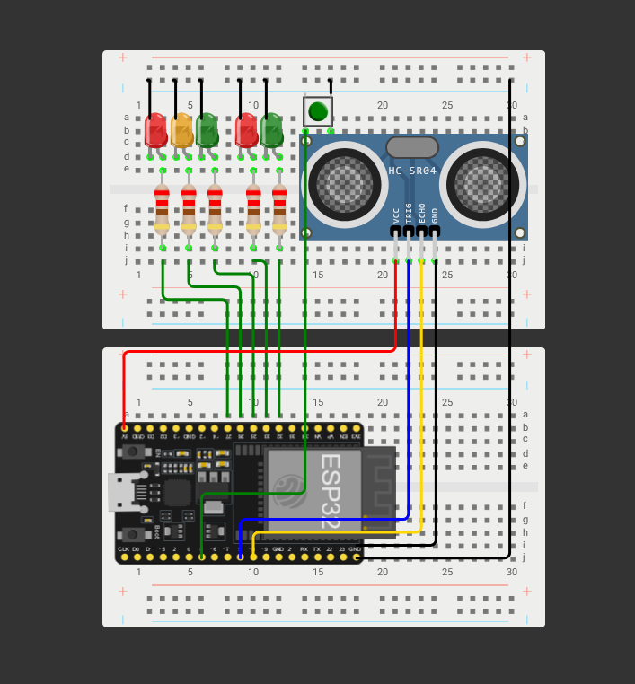

# ESP32 Inteligentný Semafor

IoT projekt inteligentného semafora postaveného na mikrokontroléri ESP32-WROOM-32D. Semafor riadi premávku a chodcov, reaguje na detekciu vozidiel pomocou ultrazvukového senzora, automaticky prepína do nočného režimu podľa reálneho času a umožňuje vzdialenú správu cez webové rozhranie.

---

## Čo projekt robí

- Riadi hlavný semafor s fázami červená, oranžová a zelená
- Riadi chodcovský semafor synchrónne s hlavným
- Detekuje vozidlá ultrazvukovým senzorom a predlžuje zelenú fázu
- Tlačidlo chodca zaznamenáva požiadavku na prechod
- Automatický nočný režim (blikajúca oranžová) podľa NTP času od 22:00 do 6:00
- Webový server na správu semafora a zobrazenie aktuálneho stavu

---

## Štruktúra projektu

```
src/
├── drivers/
│   ├── button.cpp        # Logika tlačidla chodca
│   ├── chodec.cpp        # Logika chodcovského semafora
│   ├── semafor.cpp       # Stavová mašina hlavného semafora
│   └── sensor.cpp        # Meranie vzdialenosti HC-SR04
├── headers/
│   ├── button.h
│   ├── chodec.h
│   ├── config.h          # Konfigurácia pinov, WiFi, časovania
│   ├── semafor.h
│   ├── sensor.h
│   ├── time.h
│   ├── web.h
│   └── wifi.h
├── services/
│   ├── time.cpp          # NTP čas, nočný režim
│   ├── web.cpp           # HTTP server, webové rozhranie
│   └── wifi.cpp          # Pripojenie na WiFi
└── main.cpp
```

---

## Schéma zapojenia



---

## Potrebné komponenty

| Komponent | Množstvo | Účel |
|---|---|---|
| ESP32-WROOM-32D | 1 | Hlavný mikrokontrolér |
| LED červená 5mm | 2 | Hlavný + chodcovský semafor |
| LED oranžová 5mm | 1 | Hlavný semafor |
| LED zelená 5mm | 2 | Hlavný + chodcovský semafor |
| Rezistor 220Ω | 5 | Ochrana LED diód |
| HC-SR04 | 1 | Ultrazvukový senzor vzdialenosti |
| Tlačidlo 12x12mm | 1 | Požiadavka chodca |
| Breadboard 830 bodov | 1 | Prototypovanie |
| Jumper wires | sada | Prepojenie komponentov |
| USB kábel | 1 | Napájanie a programovanie |

---

## Zapojenie pinov

| GPIO | Komponent |
|---|---|
| GPIO 25 | LED červená (hlavný semafor) |
| GPIO 26 | LED oranžová (hlavný semafor) |
| GPIO 27 | LED zelená (hlavný semafor) |
| GPIO 32 | LED červená (chodcovský semafor) |
| GPIO 33 | LED zelená (chodcovský semafor) |
| GPIO 5 | HC-SR04 TRIG |
| GPIO 18 | HC-SR04 ECHO |
| GPIO 4 | Tlačidlo chodca |

Každá LED je zapojená cez 220Ω rezistor: `GPIO → rezistor → anóda LED → katóda LED → GND`

---

## Ako projekt spustiť

### Požiadavky

- [Visual Studio Code](https://code.visualstudio.com/)
- [PlatformIO extension](https://platformio.org/install/ide?install=vscode)
- Nainštalovaný driver [CP210x](https://www.silabs.com/developers/usb-to-uart-bridge-vcp-drivers) pre ESP32

### Konfigurácia

Otvor `src/headers/config.h` a nastav svoje WiFi údaje:

```cpp
#define WIFI_SSID     "NazovTvojejSiete"
#define WIFI_PASSWORD "TvojeHeslo"
```

Pre simuláciu vo Wokwi použi:

```cpp
#define WIFI_SSID     "Wokwi-GUEST"
#define WIFI_PASSWORD ""
```

### Nahratie na dosku

1. Pripoj ESP32 cez USB
2. Over COM port v Device Manager a nastav ho v `platformio.ini`:

```ini
upload_port  = COM3
monitor_port = COM3
```

3. Klikni na šípku `→` dole v stavovom riadku VS Code alebo spusti:

```
F1 → PlatformIO: Upload
```

4. Otvor Serial Monitor (`F1 → PlatformIO: Serial Monitor`) a sleduj výpisy

### Webové rozhranie

Po úspešnom pripojení na WiFi vypíše Serial Monitor IP adresu:

```
Web server bezi na: http://192.168.x.x
```

Otvor túto adresu v prehliadači pre správu semafora.

---

## Simulácia vo Wokwi

Projekt je možné simulovať online bez fyzického hardvéru.

1. Choď na [wokwi.com](https://wokwi.com) a vytvor nový ESP32 projekt
2. Vlep obsah `diagram.json` do záložky diagram
3. Vlep kód do záložky sketch
4. Klikni na tlačidlo Play

Alebo použi Wokwi VS Code extension — simulácia beží priamo vo VS Code s tvojim lokálne skompilovaným firmvérom.

---

## Technológie

| Technológia | Využitie |
|---|---|
| C++ / Arduino framework | Programovanie ESP32 |
| PlatformIO | Build systém, správa knižníc, upload |
| Visual Studio Code | Vývojové prostredie |
| Wokwi | Simulácia obvodu a kódu |
| ESPAsyncWebServer | Asynchrónny HTTP server na ESP32 |
| NTPClient | Synchronizácia reálneho času |
| WiFi (ESP32 built-in) | Pripojenie na sieť |

### Knižnice

```ini
lib_deps =
  arduino-libraries/NTPClient @ ^3.2.1
  esphome/ESPAsyncWebServer-esphome @ ^3.1.0
```

---

## Autor

Ladislav Spevák
